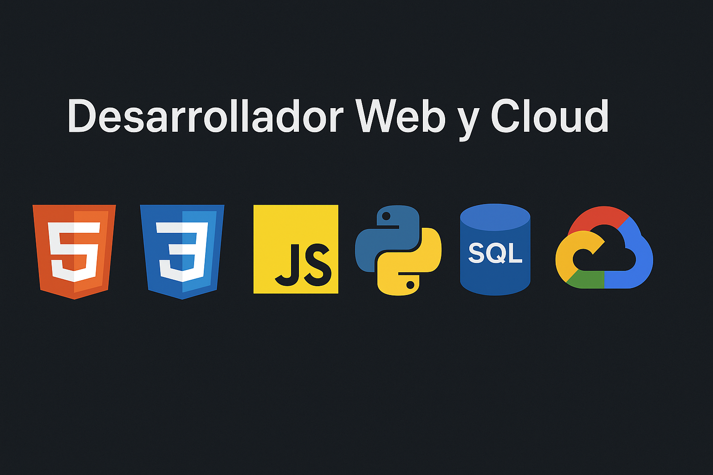

<!-- Banner -->

# 👋 Hola, soy Edwin Fernando Aldana

💻 Desarrollador con interés en el desarrollo web, bases de datos y tecnologías en la nube.  
📌 Apasionado por crear soluciones eficientes y escalar proyectos con buenas prácticas.

---

## 🚀 Tecnologías y Herramientas

### 🌐 Frontend

  
  

### ⚙️ Backend

  

### 🗄️ Bases de Datos

  
  

### ☁️ Cloud & DevOps

  
Administración de recursos en GCP (Compute Engine, IAM, Networking, etc.)

---

## 📈 Estadísticas de GitHub

  

---

## 📫 Contacto

- ✉️ Email: [edwinfer22@gmail.com](mailto:edwinfer22@gmail.com)
- 💼 LinkedIn: [Edwin Fernando Aldana](https://www.linkedin.com/in/edwin-fernando-aldana-abril-b2470634)
- 🌐 Portafolio: _(En Construcción)_

---

⭐️ Desde Edwin Fernando Aldana — _"Construyendo hoy la tecnología del mañana"_
